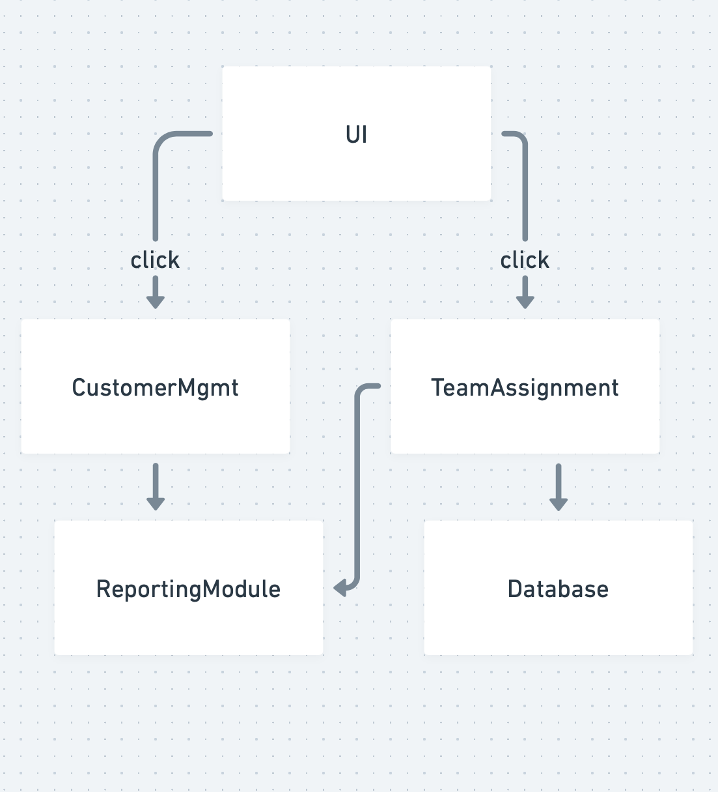

# Design Diagrams for Custom CRM Project

## Title:
**Custom CRM tool for Small-to-Medium Businesses**

## Goal Statement:
To design and develop a user-friendly CRM system that enables businesses to efficiently manage customer data, assign team roles, and track customer interactions to improve operational productivity and customer satisfaction.

---

### Conventions:
- **Boxes:** Represent modules, systems, or processes in the design.
- **Arrows/Lines:** Represent data flow or interactions between modules or processes.
- **Ovals/Circles:** Represent inputs and outputs to the system.

---

## Design D0: High-Level View

### Description:
The highest-level design depicts the core input and output of the CRM system, illustrating the relationship between users, the system, and the expected results.

**Diagram Explanation:**
- **Input:** User actions such as customer data entry, team assignments, and report requests.
- **System:** The CRM system processes the inputs through its backend logic.
- **Output:** Updated customer database, team assignments, and generated reports.

---

## Design D1: Subsystems Overview

### Description:
This design breaks down the CRM system into key modules, showcasing the interactions between them.

**Modules:**
1. **User Interface (UI):** Accepts inputs and displays outputs.
2. **Customer Management:** Handles adding, updating, and deleting customer data.
3. **Team Assignment Module:** Manages team-member assignments for customers.
4. **Reporting Module:** Generates reports based on customer and team data.
5. **Database:** Stores all data for the system.

---

## Design D2: Detailed System Architecture

### Description:
The most detailed view of the system includes specific processes, inputs, and outputs within each module.

**Details:**
1. **UI Module:**
    - Input: User login, customer data forms, team assignment inputs.
    - Output: Notifications, dashboards, reports.
2. **Customer Management Module:**
    - Input: Customer data from UI.
    - Processes: Data validation, CRUD operations.
    - Output: Updated customer records.
3. **Team Assignment Module:**
    - Input: Customer IDs, team member IDs.
    - Processes: Assignments stored in database.
    - Output: Team assignment confirmations.
4. **Reporting Module:**
    - Input: Query parameters from UI.
    - Processes: Data aggregation, analytics.
    - Output: Customized reports.
5. **Database:**
    - Input: Data from Customer Management and Team Assignment.
    - Output: Structured data for all modules.

