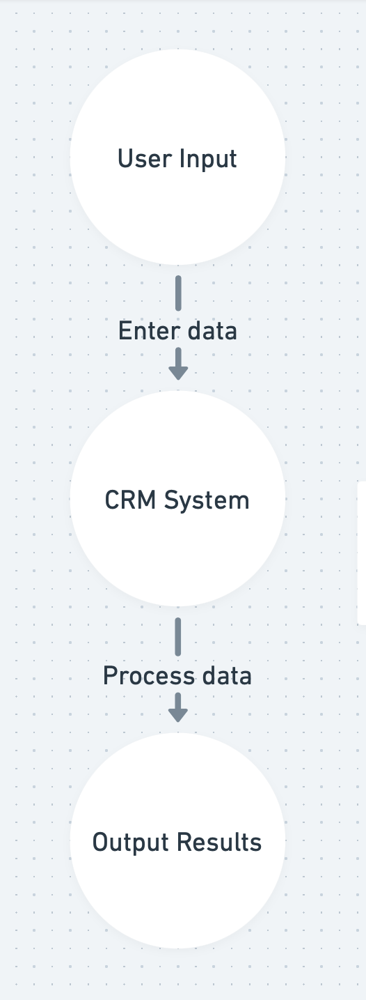
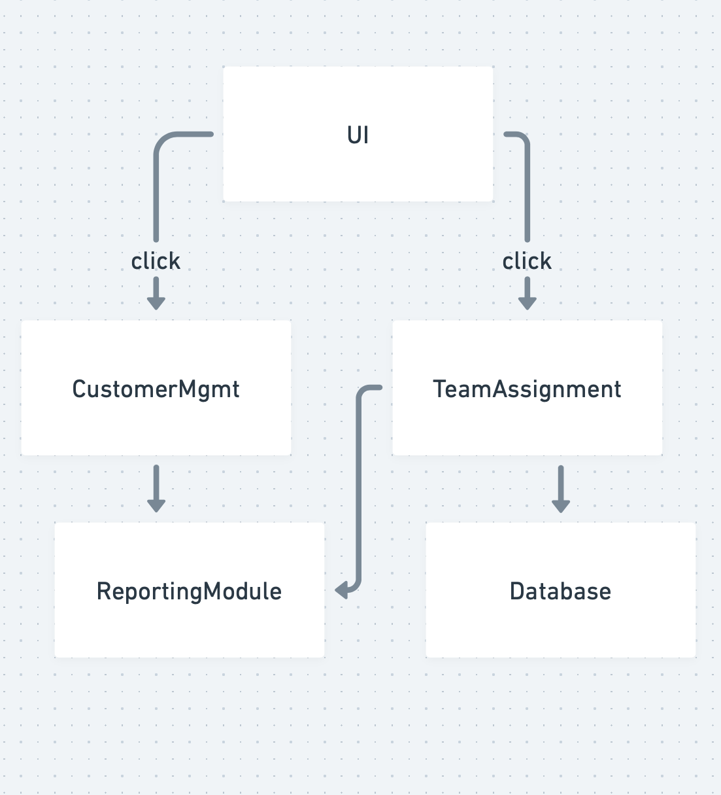
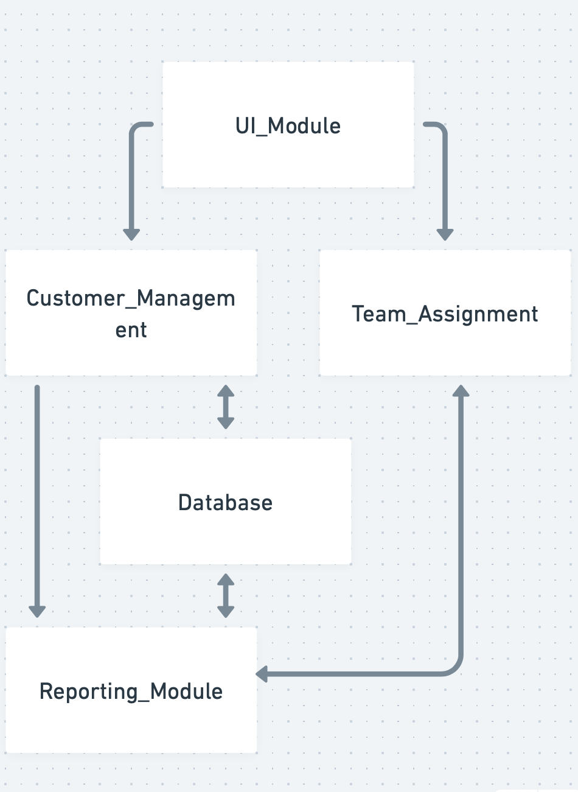

# Fall Design Reports

## Table of Contents
1. [Team Names and Project Abstract](#team-names-and-project-abstract)
2. [Project Description (Assignment #2)](#project-description-assignment-2)
3. [User Stories and Design Diagrams (Assignment #4)](#user-stories-and-design-diagrams-assignment-4)
4. [Project Tasks and Timeline (Assignment #5-6)](#project-tasks-and-timeline-assignment-5-6)
5. [ABET Concerns Essay (Assignment #7)](#abet-concerns-essay-assignment-7)
6. [Self-Assessment Essays (Assignment #3)](#self-assessment-essays-assignment-3)
7. [Professional Biographies (Assignment #1)](#professional-biographies-assignment-1)
8. [Appendix](#appendix)

---

## Team Names and Project Abstract

**Team Name:** Custom CRM  
**Team Members:** Nachiket Dighe
**Advisor:** Sabrina Pang  

**Abstract:**  
The project aims to develop a custom Customer Relationship Management (CRM) system using a Django-Tailwind-SQLite tech stack. The CRM will enable users to add/delete customer records, track data, and assign teams to individuals, providing an efficient and streamlined solution for managing customer relationships.

---

## Project Description 

This is a Django-based customer relationship management (CRM) platform tailored for managing customers and companions. Superusers can add, edit, and delete customer profiles, manage associated pet information, and assign teams to plans. The platform includes authentication, an admin interface, and customizable user roles.

---

## User Stories and Design Diagrams 

### User Stories
1. **As a small business owner**, I want to easily add and delete customer profiles to keep my customer database up-to-date and organized.
2. **As a team manager**, I want to assign customers to specific team members to ensure personalized and efficient customer service.
3. **As a sales representative**, I want to view detailed customer information in one place to better prepare for meetings and close deals more effectively.
4. **As a system administrator**, I want to manage user access and permissions to maintain the security and integrity of the system.
5. **As a business analyst**, I want to generate reports on customer interactions and team performance to identify trends and optimize business strategies.

### Design Diagrams
- **Level 0 Diagram:** 
- **Level 1 Diagram:** 
- **Level 2 Diagram:** 

Descriptions of diagrams and conventions are missing and should be added as applicable.

---

## Project Tasks and Timeline 

### Task List
- **Project Initialization (October 20):**
  - Finalize project requirements and objectives.
  - Set up the development environment with the Django-Tailwind-SQLite tech stack.
  - Prepare the initial project repository and folder structure.
- **UI Design and Implementation (October 27):**
  - Complete the user interface (UI) layout design for all forms and dashboards.
  - Implement responsive designs using Tailwind CSS.
  - Conduct initial testing of UI elements.
- **Database Schema Design (November 3):**
  - Design and implement the database schema for customer and team management.
  - Populate the database with sample data for testing.
- **Customer Management Module (November 17):**
  - Develop CRUD operations for customer profiles.
  - Validate and test all operations thoroughly.
- **Team Assignment Module (December 1):**
  - Implement functionality to assign customers to team members dynamically.

### Effort Matrix

| **Task**                      | **Date**         | **Description**                                                                 | **Hours** |
|-------------------------------|------------------|---------------------------------------------------------------------------------|-----------|
| Project Initialization        | October 20       | Finalized project requirements, set up the development environment, and repository structure. | 10        |
| UI Design and Implementation  | October 27       | Designed UI layout for forms and dashboards, implemented responsive designs, and tested UI elements. | 12        |
| Database Schema Design        | November 3       | Designed and implemented database schema for customer and team management. Populated sample data. | 8         |
| Customer Management Module    | November 17      | Developed CRUD operations for customer profiles and validated/testing all features. | 10        |
| Team Assignment Module        | December 1       | Implemented functionality to assign customers dynamically to team members.       | 8         |
| **Total Hours**               |                  |                                                                                 | **47**    |

---
---

## ABET Concerns Essay 

- **Economic Constraints:**  
  The project is constrained by open-source technologies such as Django, Tailwind CSS, and SQLite, so there is no budget required for proprietary tools or frameworks. This decision ensures the project remains cost-effective but may limit certain advanced features in paid software. Additionally, resources like server hosting and deployment environments must be carefully selected to minimize costs while ensuring reliability.

- **Professional Constraints:**  
  This project showcases professional skills and will add to the developer's portfolio. It requires expertise in full-stack development, database design, and project management. To be successful, the project must adhere to industry standards for code quality, scalability, and usability, highlighting the developer's competence.

- **Ethical Constraints:**  
  Ethical considerations include the secure handling of customer data to ensure privacy and prevent misuse. The system must comply with data protection principles, ensuring sensitive information is neither exposed nor exploited. Features like user authentication and role-based access control are designed to uphold these ethical responsibilities.

- **Security Constraints:**  
  The CRM system must address potential vulnerabilities to ensure the integrity of the system. Threats such as data breaches, unauthorized access, and malicious attacks are mitigated by implementing robust encryption protocols, secure authentication mechanisms, and regular security testing. Special attention is given to safeguarding the system against eavesdropping and unauthorized data access.

---
## Presentation

[Download PPT](Design_Diagrams/ApresCleo_presentation.pptx)

## Self-Assessment Essays

My senior design project focuses on building a custom Customer Relationship Management (CRM) system utilizing a Django-Tailwind-SQLite tech stack.

From my academic perspective, this project represents the culmination of years of study in computer science, combining theoretical understanding and practical application to create a robust, user-friendly system. The CRM will allow businesses to add and delete customers, manage their data, and assign teams, streamlining operations and enhancing productivity.

This project aligns with my academic goals while serving as an opportunity to showcase the skills I've honed throughout college. Courses such as Data Structures, Algorithms, and Database Systems have been instrumental in preparing me, as have my co-op experiences at Delta Air Lines.

---

## Professional Biographies 

### Contact Information
**Email:** [dighent@mail.uc.edu](mailto:dighent@mail.uc.edu)

### Co-op Work Experience
1. **Job Title:** Data Science co-op  
   **Company:** Delta Air Lines  
   **Dates of Employment:** June 24 - Aug 24
2. **Job Title:** Data Science co-op  
   **Company:** Delta Air Lines  
   **Dates of Employment:** June 23 - Aug 23
3. **Job Title:** Data Analysis co-op  
   **Company:** Delta Air Lines  
   **Dates of Employment:** Aug 22 - Dec 22
 4. **Job Title:** IOS App Development co-op  
   **Company:** Chamberlain Group
   **Dates of Employment:** Jan 22 - Apr 22

### Technical Skills
- **Programming languages:** Ajax, C#, C++, CSS, Java, JavaScript, Python, R, Ruby, Swift, TypeScript
- **Tools:** AWS EC2 S3, CocoaPods, Excel, Git, MySQL, Nginx, Node.JS, Postman, SQLite, Salesforce, Visual Studio Code
- **Frameworks:** Angular, Axios, Cheerio, CocoaMQTT, Django, Express, Flask, React, Solid, SwiftUI, Tailwind

---

## Appendix

- [References and Citations](#)
- [Code Repositories](#)
- [Meeting Notes](#)
